# DevHub Pro

<p align="center">
  
</p>

A single-user developer portal that catalogs GitHub-hosted projects as **assets**, reconstructs their dependency graph from real build artifacts (Maven today; Gradle / npm next), drives builds and runtime on docker and Kubernetes, and exposes the whole surface to Claude Code through MCP.

> **Code . Build . Deploy . Monitor** — one place to keep track of everything you own and one place to do something about it.

Postgres is the database of record. Workspaces, secrets, logs, and rendered manifests live under `~/.devportal/`. State can be exported as YAML to a separate `devportal-state` git repo for backup; that repo is **not** the source of truth.

---

## Table of contents

- [Architecture](#architecture)
- [What it does](#what-it-does)
- [Tour](#tour)
- [Quickstart](#quickstart)
- [Repository layout](#repository-layout)
- [Configuration](#configuration)
- [Subsystems in depth](#subsystems-in-depth)
  - [Asset catalog and onboarding](#asset-catalog-and-onboarding)
  - [Maven analysis and auto-wire](#maven-analysis-and-auto-wire)
  - [Build orchestration](#build-orchestration)
  - [Workspaces](#workspaces)
  - [Docker](#docker)
  - [Kubernetes](#kubernetes)
  - [Port registry](#port-registry)
  - [Endpoint discovery](#endpoint-discovery)
  - [Port-forward service](#port-forward-service)
  - [Workspace shell](#workspace-shell)
  - [Dependency graph UI](#dependency-graph-ui)
  - [Search](#search)
  - [State sync](#state-sync)
  - [Bulk import](#bulk-import)
  - [Lifecycle hooks (test fixtures + setup hooks)](#lifecycle-hooks-test-fixtures--setup-hooks)
- [MCP server](#mcp-server)
- [Claude Code skills](#claude-code-skills)
- [Data model](#data-model)
- [URLs](#urls)
- [Development](#development)

---

## Architecture

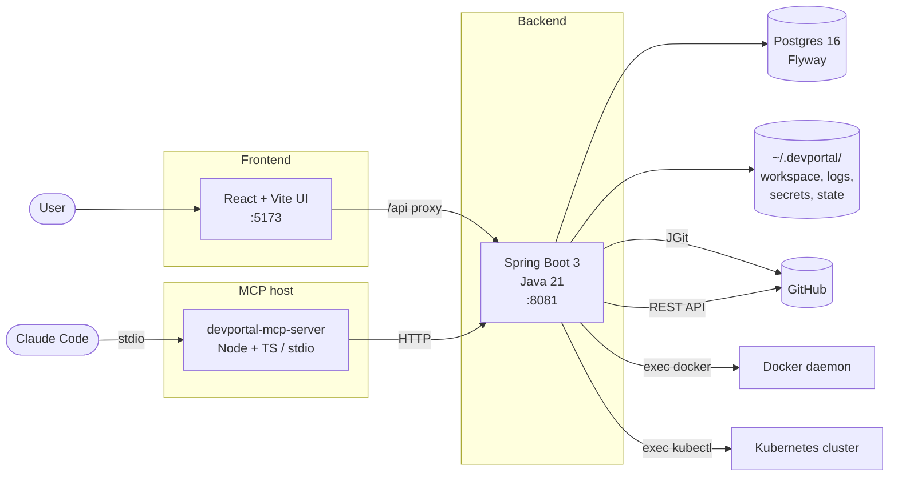
```mermaid
graph LR
    User([User])
    Claude([Claude Code])
    GH[(GitHub)]
    DK[Docker daemon]
    K8s[Kubernetes cluster]

    subgraph Frontend
        UI[React + Vite UI<br/>:5173]
    end

    subgraph Backend
        BE[Spring Boot 3<br/>Java 21<br/>:8081]
    end

    subgraph MCPHost[MCP host]
        MCP[devportal-mcp-server<br/>Node + TS / stdio]
    end

    PG[(Postgres 16<br/>Flyway)]
    FS[(~/.devportal/<br/>workspace, logs,<br/>secrets, state)]

    User --> UI
    UI -->|/api proxy| BE
    Claude -->|stdio| MCP
    MCP -->|HTTP| BE
    BE --> PG
    BE --> FS
    BE -->|JGit| GH
    BE -->|REST API| GH
    BE -->|exec docker| DK
    BE -->|exec kubectl| K8s
```

The backend is the single trust boundary. The frontend talks to it over HTTP via Vite's `/api/*` proxy, so there's no CORS config to maintain. The MCP server is a thin stdio adapter over the same REST API — every Claude tool call ultimately becomes an HTTP request to port 8081.

---

## What it does

### Catalog and graph
- Register GitHub repos as assets one at a time, or **bulk-import a whole org** filtered by language and name pattern.
- Asset detail with overview, description, GitHub topics, stars / forks / open issues / license, recent **git tags**, last push time.
- **Dependency graph** auto-derived from each repo's `pom.xml` (multi-module, with `${prop}` substitution).
- **Auto-wire** matched Maven coordinates to existing portal assets — idempotent: stale edges are pruned when the pom changes.
- Graph viewer with **direction control** (producers / consumers / both), **depth control** (1, 2, 3, 5, all), `LR`/`TB` layout toggle, and a fullscreen viewer.

### Build orchestration
- **Shallow build** — just this asset.
- **Deep build** — topo-sort the producer closure, run producers serially as siblings of the requested asset's build, halt on first failure.
- **Live log streaming** — captured stdout/stderr per build, auto-tails while running, freezes when terminal.
- **Chain view** — one click triggers a deep build of N assets; the UI surfaces all N segments inline.
- Per-tool fallbacks when no `devportal.yaml` is present:
  - `pom.xml` -> `mvn -DskipTests <goal>`
  - `build.gradle*` -> `./gradlew -x test <task>`
  - `package.json` -> `<pm> run <script>`

### Runtime — docker + light Kubernetes
- **Port registry**: assets declare named slots (`http`, `metrics`, ...); portal allocates concrete ports per scope (`local` / `k8s-nodeport`) from configured pools, with collision-free guarantees enforced by a unique constraint.
- **Docker**: build image, run container with allocated ports + asset label, list / stop, scaffolded thin Dockerfile when missing.
- **Kubernetes**: per-asset namespace (defaults to repo name, ensure-namespace before apply), `kubectl apply` / `delete` from the workspace's manifest path with NodePort patching, pod & service status, pod logs / describe / events / exec via WebSocket, link-out hints (`k9s`, `kubectl logs`, optional Grafana).
- **Endpoint discovery** aggregates host-accessible URLs (local docker, k8s NodePort) and in-cluster URLs (ClusterIP) with port-forward expose hints.
- **Port-forward service**: manages `kubectl port-forward` subprocesses, host port auto-allocated from the local pool, sessions are dev-time only and die with the portal.
- **Meta-assets** for shared infrastructure (postgres, redis, opensearch, minio, ...) — assets `consume` them with a role label.
- **Workspace shell** — open an xterm.js terminal in the browser that runs in `~/.devportal/workspace/<assetId>` over a WebSocket, wrapped in `script(1)` for a real PTY.

### Discovery and analyze
- **Workspace scanner** identifies `Dockerfile`, `docker-compose.yml`, `k8s/` / `deploy/` / `manifests/`, helm charts, kustomizations.
- **Maven analyzer** parses each repo's pom — published artifacts and declared dependencies — and persists asset coordinates so cross-repo matching works.
- **GitHub validator** confirms the repo URL parses, is reachable, reports what build files are present.
- **Audit** — drift report against portal conventions: missing manifest, schema errors, missing docs, missing Dockerfile when `docker.enabled`, no port slots, etc.

### Search and docs
- **Global search bar** in the top header — debounced, dropdown results.
  - **Asset matches** — ILIKE across id, name, description, owner, language, repo URL, tags.
  - **Doc matches** — substring scan of every asset workspace's `.md` files, with line number and snippet.
- **Docs tab** per asset — sidebar lists every `.md`, click to render, toggle Rendered / Raw.

### Settings, state, secrets
- **GitHub PAT** stored at `~/.devportal/secrets/github-token` (mode 0600), settable via UI. Lookup order: file -> `GITHUB_TOKEN` env -> none. Hot-swappable.
- **State sync**: dump / load full portal state as YAML to a separate `~/.devportal/state` git repo.

### UI extensibility
- Build-time React component split per concern (assets, builds, runtime, analyze, docs, panels).
- **Server-driven panels** — `GET /api/assets/{id}/panels` returns a list of `kv | list | code | links` panels rendered generically by the frontend; new panels can be added server-side without touching the UI.

---

## Tour

A walk through the UI. Numbered markers point to the corresponding entry in the legend strip underneath each image.

### Dashboard — pinned services with one-click start/stop

Pin any asset to the dashboard and start/stop its whole runtime closure (the asset plus every transitive runtime producer) from a single button — `Start` runs `kubectl apply` and the lifecycle hooks, `Stop` runs `kubectl delete`. The live chip turns green as soon as any declared endpoint is reachable. Web UI quick-links, auto-detected Swagger URLs, and credential-fixture quick-links are promoted out of the manifest. `Hide off` collapses stopped cards so the dashboard is just whatever is running right now.

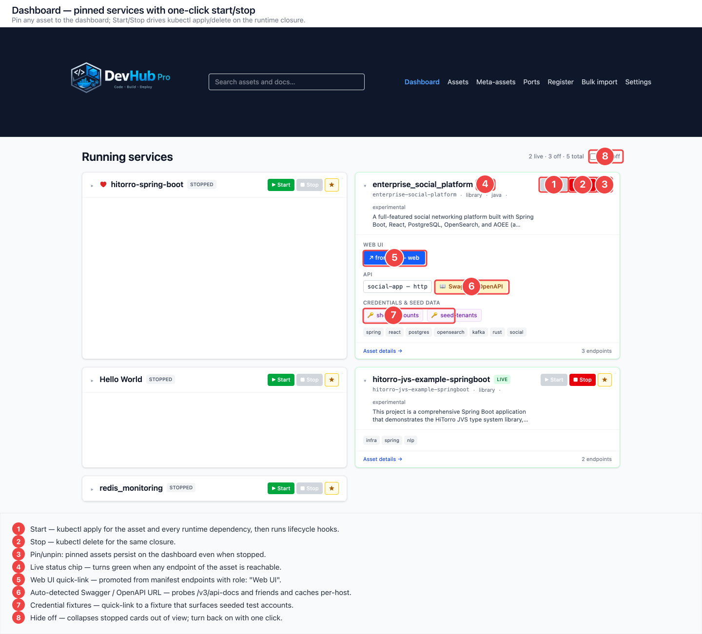

### Assets list — search, filter, favorites, ratings

Catalog of every registered asset. Pinned 5-star favorites surface in a top strip so they're always one click away. Multi-term search defaults to OR across name / description / tags / owner / language / repo URL; the `all of` toggle forces AND. Filter by type (library, service, infra, …) or hide everything except favorites.

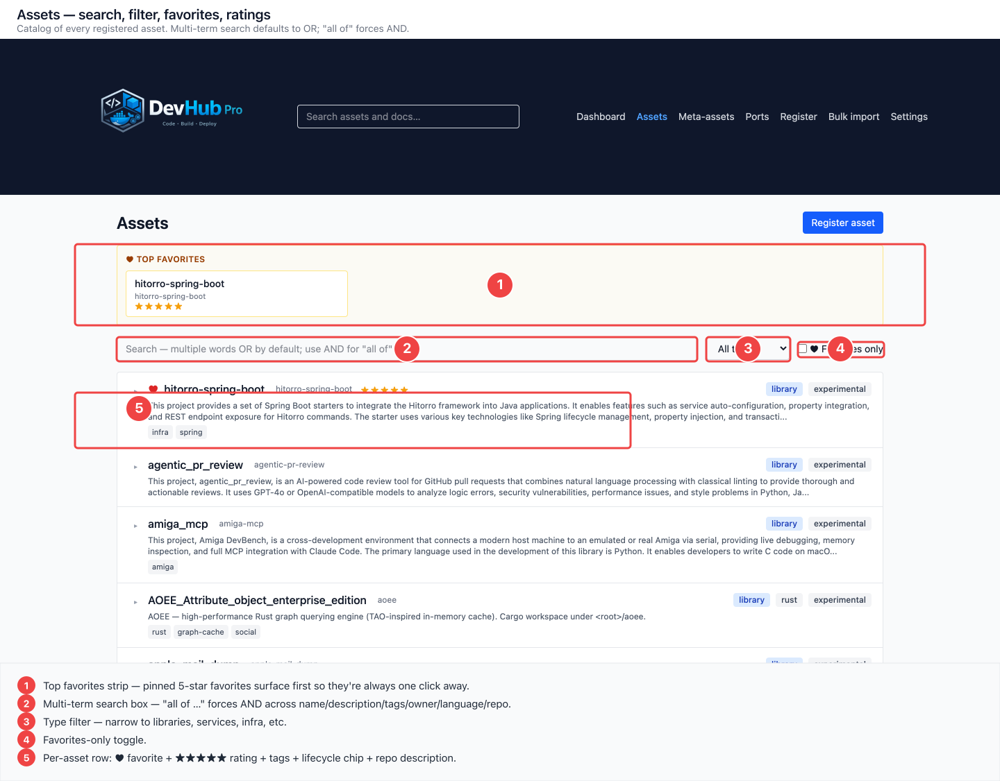

### Global search — assets and full-text doc hits

The header search drops down with asset matches alongside full-text hits inside every workspace's `.md` files, with line-number snippets and the matching term highlighted.

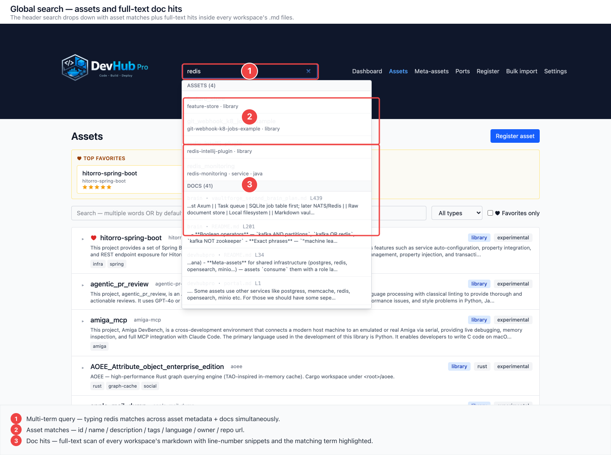

### Asset detail — overview tab

Per-asset detail with the full tab strip — overview, dependencies, graph, builds, runtime, cluster, analyze, changes, fixtures, docs, panels. Favorite, rate, and pin from the top bar. **Ask Claude** opens an annotated context dump tailored to this asset (manifest, deps, recent commits, …). Tags share a single namespace across the whole catalog with autocomplete.

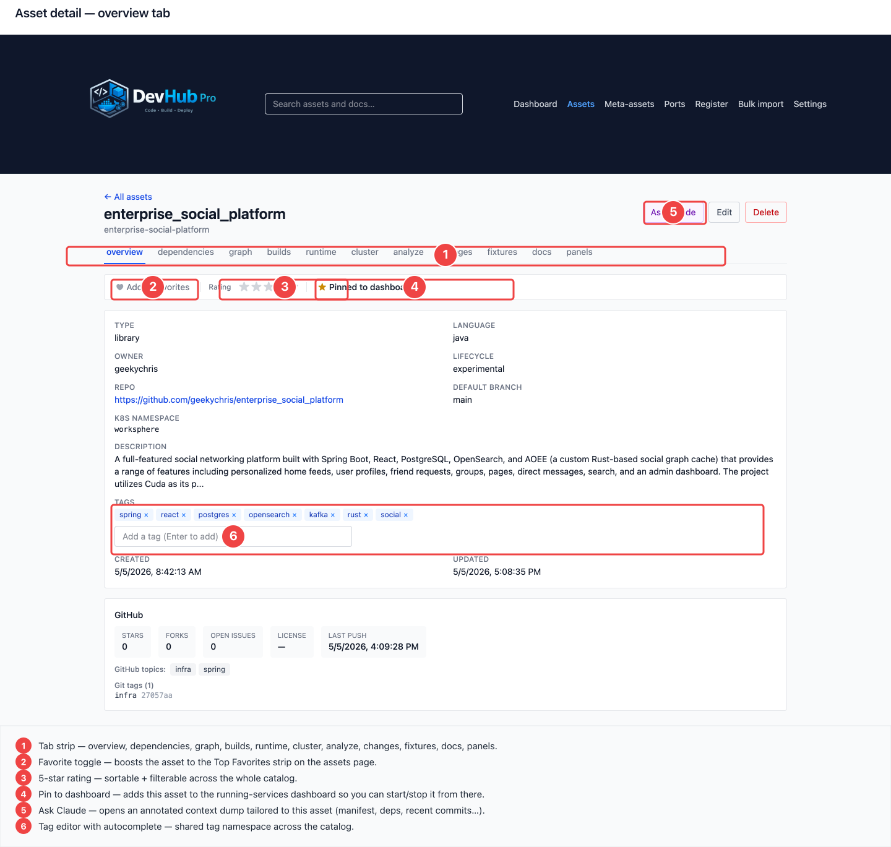

### Panels tab — at-a-glance dossier

Auto-generated panels — GitHub, workspace, manifest summary, health checks, quick actions, recent activity, endpoints, audit findings, and discovered sources from the analyzer. Opt-in info, not a tab cliff. Server-driven, so new panels can be added backend-side without touching the UI.

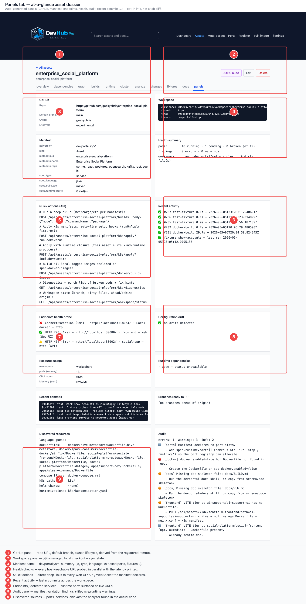

### Dependency graph — producers and consumers

Interactive React Flow graph laid out by dagre, with edge labels for the dependency kind (`build`, `runtime`, `data`, …) read straight from the manifest. Direction filter (producers / consumers / both), independent producer and consumer depth caps so you can include direct callers without exploding the graph, layout toggle (`producers right` / `producers down`), and a fullscreen viewer for very large graphs.

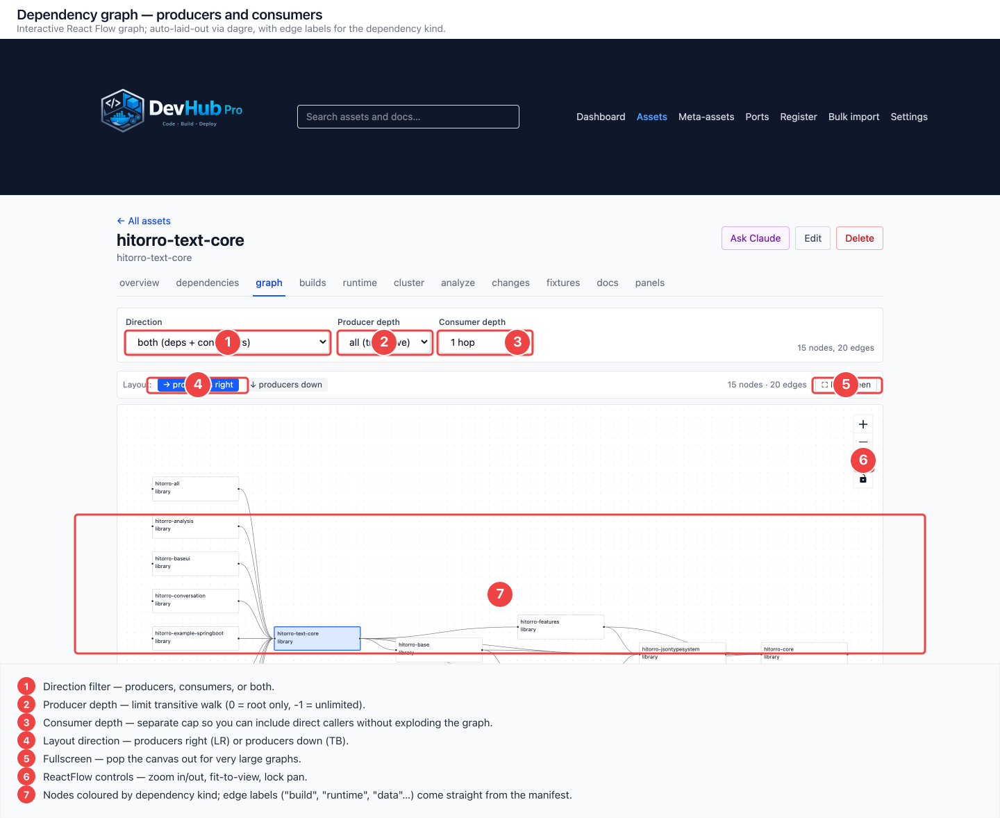

### Test fixtures — surfaced credentials and seed data

Fixtures emit a structured `DEVPORTAL_FIXTURE:` JSON line so the portal extracts usernames, passwords, login URLs and roles, and renders them in a credentials table with click-to-copy passwords. Quick-launch links open the right URL signed in as the right user in one click. Each run captures exit code, duration, timestamp, and the full log behind `Show log`.

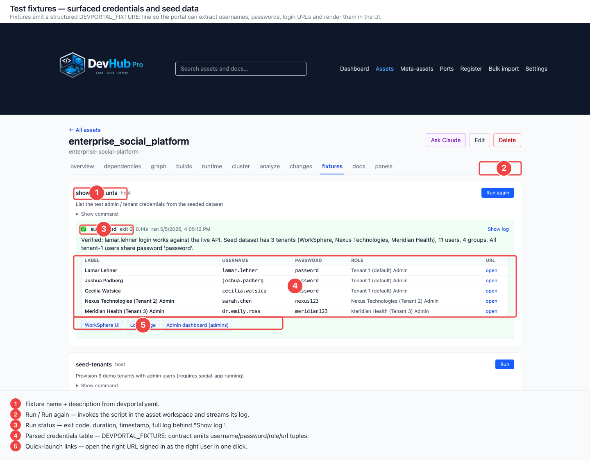

### Docs tab — markdown with rendered Mermaid

Every `.md` in the asset workspace is browseable from a sidebar tree. Mermaid blocks render to SVG inline; mermaid is dynamic-imported so the docs page only pays for it when needed. The renderer falls back to a styled error block on bad syntax, and `Raw` links back to the original markdown for copy-pasting to GitHub.

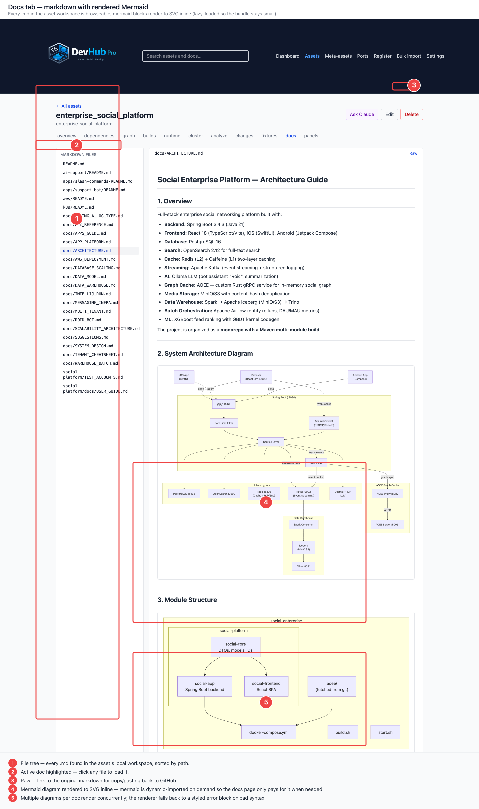

### Runtime tab — ports, docker, kubectl

All runtime surfaces in one view: the port registry slots for this asset (allocate / release in `local` or `k8s-nodeport` scope), local docker images, and the kubectl apply target. `+ dependents` applies the full runtime closure — this asset and every transitive runtime producer.

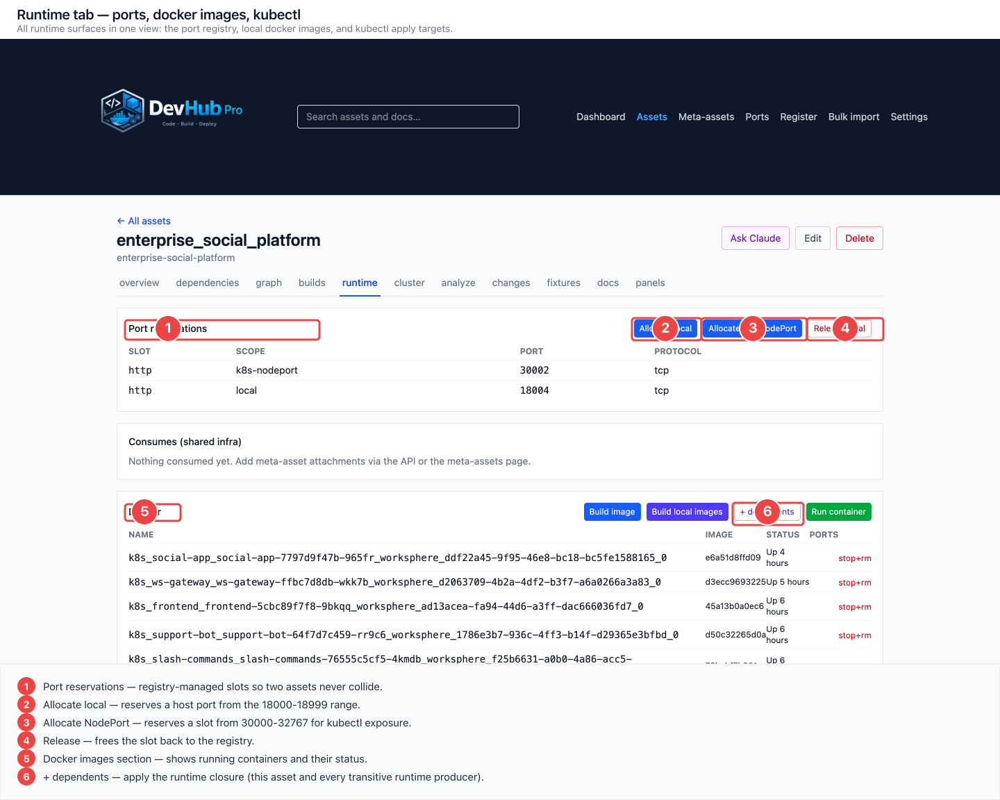

### Port registry — every port the portal knows about

Three sources unified: local docker host ports, Kubernetes NodePorts, and active `kubectl port-forward` tunnels. Single registry across the whole portal, so two assets can never collide on a port. Filter by asset id, port, URL, or pod name; group by scope or by asset; click any URL to copy it for Postman / curl / browser.

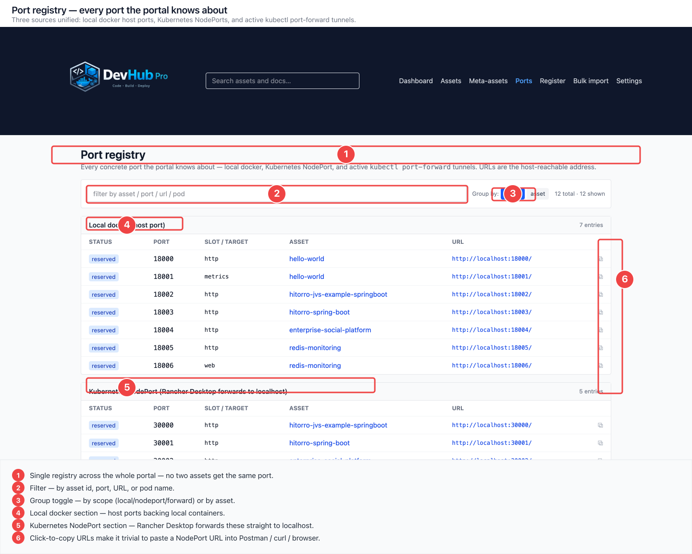

---

## Quickstart

### Prerequisites

- **Java 21** (Spring Boot 3 will not compile against older JDKs).
- **Node 20+** with **pnpm** (`brew install node && npm install -g pnpm`).
- **Postgres 15+** running locally (or via Docker — see below).
- **Docker** + **kubectl** (only needed for runtime features).
- A **GitHub Personal Access Token** (classic, scope `repo`) — set later via the UI.

### Postgres — pick one

Option A — Docker (uses the bundled compose file):
```sh
docker compose up -d
```

Option B — native Homebrew:
```sh
brew install postgresql@16
brew services start postgresql@16
createuser -s devportal
createdb -O devportal devportal
psql -d devportal -c "ALTER ROLE devportal WITH PASSWORD 'devportal';"
```

### Backend — http://localhost:8081

```sh
cd backend
./gradlew bootRun
```

Flyway runs all migrations on first start. Port `8081` is hard-coded in `application.yml` because Rancher Desktop's gvproxy holds `8080`.

### Frontend — http://localhost:5173

```sh
cd frontend
pnpm install
pnpm dev
```

Vite proxies `/api/*` and `/ws/*` to the backend.

### MCP server (optional — for Claude Code integration)

```sh
cd mcp-server
pnpm install
pnpm build
```

Then in `~/.claude/mcp.json`:

```json
{
  "mcpServers": {
    "devportal": {
      "command": "node",
      "args": ["/absolute/path/to/dev_portal/mcp-server/dist/index.js"],
      "env": { "DEVPORTAL_URL": "http://localhost:8081" }
    }
  }
}
```

Restart Claude Code -> `mcp__devportal__*` tools become available.

### Skills (optional)

```sh
mkdir -p ~/.claude/skills
ln -s "$(pwd)/skills/devportal-onboard"     ~/.claude/skills/
ln -s "$(pwd)/skills/devportal-audit"       ~/.claude/skills/
ln -s "$(pwd)/skills/devportal-docs"        ~/.claude/skills/
ln -s "$(pwd)/skills/devportal-k8s-convert" ~/.claude/skills/
```

### First-run walkthrough

1. Open **http://localhost:5173** -> **Settings** -> paste GitHub PAT -> **Test connection**.
2. **Bulk import** -> owner `geekychris` (or your own org), tick **Java** + **Kotlin**, optional include pattern `^hitorro-`. **Run import**.
3. After ~1 minute, **/assets** lists your registered repos.
4. Open `/assets/<some-java-repo>` -> **analyze** tab -> **Analyze pom.xml** -> **Auto-wire matched deps**. Repeat for a few repos to populate the graph.
5. **graph** tab -> switch direction / depth -> see the dep tree.
6. **builds** tab -> mode `deep`, command `package` -> **Run build** -> watch the chain assemble.
7. Top-bar **search** -> type `spring` -> see assets and doc snippets that match.

---

## Repository layout

| Path                  | Purpose                                                                    |
|-----------------------|----------------------------------------------------------------------------|
| `backend/`            | Spring Boot 3 + Java 21 + Postgres. Source of truth. Gradle Kotlin DSL.    |
| `frontend/`           | Vite + React 18 + TypeScript + Tailwind UI.                                |
| `mcp-server/`         | MCP stdio server exposing portal ops to Claude Code.                       |
| `skills/`             | Claude Code skills (`devportal-onboard`, `-audit`, `-docs`, `-k8s-convert`). |
| `schema/`             | `devportal.yaml` JSON Schema + doc-skeleton templates + sample manifest.   |
| `docker-compose.yml`  | Postgres for local dev.                                                    |
| `devhubpro.png`       | Brand logo.                                                                |
| `CLAUDE.md`           | Project memory for Claude Code.                                            |

The assets dev_portal **manages** live in their own GitHub repos (initially under `geekychris/...`); they are not nested in this tree.

---

## Configuration

Backend reads from `application.yml` plus env overrides:

| Key                                          | Env var                  | Default                                   |
|----------------------------------------------|--------------------------|-------------------------------------------|
| `server.port`                                | —                        | `8081`                                    |
| `devportal.github.token`                     | `GITHUB_TOKEN`           | (file at `~/.devportal/secrets/...` wins) |
| `devportal.workspace.dir`                    | `DEVPORTAL_WORKSPACE_DIR`| `~/.devportal/workspace`                  |
| `devportal.state.repo`                       | `DEVPORTAL_STATE_REPO`   | `~/.devportal/state`                      |
| `devportal.ports.local.{start,end}`          | —                        | `18000-18999`                             |
| `devportal.ports.k8s-nodeport.{start,end}`   | —                        | `30000-32767`                             |
| `devportal.k8s.namespace`                    | —                        | `default`                                 |
| `devportal.k8s.monitoring-base-url`          | —                        | empty (Grafana link disabled)             |
| `spring.datasource.*`                        | `DEVPORTAL_DB_*`         | `localhost:5432/devportal/devportal`      |

**Never embed a port in code.** Always pull from the port registry.

---

## Subsystems in depth

### Asset catalog and onboarding

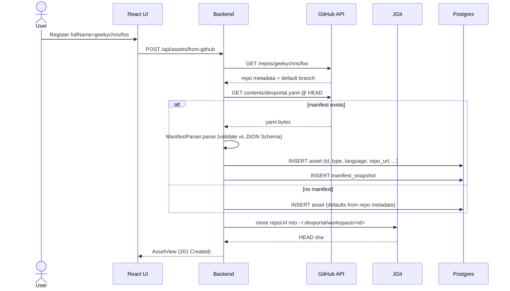
```mermaid
sequenceDiagram
    actor User
    participant UI as React UI
    participant API as Backend
    participant GH as GitHub API
    participant JGit
    participant DB as Postgres

    User->>UI: Register fullName=geekychris/foo
    UI->>API: POST /api/assets/from-github
    API->>GH: GET /repos/geekychris/foo
    GH-->>API: repo metadata + default branch
    API->>GH: GET contents/devportal.yaml @ HEAD
    alt manifest exists
        GH-->>API: yaml bytes
        API->>API: ManifestParser.parse (validate vs JSON Schema)
        API->>DB: INSERT asset (id, type, language, repo_url, ...)
        API->>DB: INSERT manifest_snapshot
    else no manifest
        API->>DB: INSERT asset (defaults from repo metadata)
    end
    API->>JGit: clone repoUrl into ~/.devportal/workspace/<id>
    JGit-->>API: HEAD sha
    API-->>UI: AssetView (201 Created)
```

The asset id is slugified from the repo name unless overridden. Onboarding does not require a `devportal.yaml`; if absent, defaults are inferred from GitHub metadata. Subsequent operations (analyze, build, allocate-ports) auto-clone the workspace if it isn't there yet, so no "run a build first" round-trip.

### Maven analysis and auto-wire

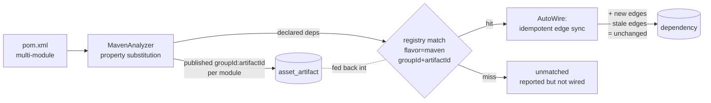
```mermaid
flowchart LR
    POM[pom.xml<br/>multi-module] --> MA[MavenAnalyzer<br/>property substitution]
    MA -->|published groupId:artifactId<br/>per module| AA[(asset_artifact)]
    MA -->|declared deps| MATCH{registry match<br/>flavor=maven<br/>groupId+artifactId}
    AA -.fed back into.- MATCH
    MATCH -->|hit| AW[AutoWire:<br/>idempotent edge sync]
    MATCH -->|miss| UNM[unmatched<br/>reported but not wired]
    AW -->|+ new edges<br/>- stale edges<br/>= unchanged| DEP[(dependency)]
```

Auto-wire runs `analyze` then reconciles dependency edges against what the pom currently declares: edges for matched producers that the DB doesn't have are added, edges that the pom no longer declares are removed. This keeps the graph clean across pom changes and prevents stale edges from creating false cycles. See `backend/src/main/java/io/devportal/analyze/AnalyzeService.java`.

### Build orchestration

The build module distinguishes two modes:

- **Shallow** — build just the requested asset.
- **Deep** — topo-sort the producer closure (Kahn's algorithm in `DependencyWalker`), run producers serially as **siblings** of the root build, then run the root last.

The deep flow was recently fixed so that the root build represents the user-requested asset itself (mode=`deep`, parent=null), appearing immediately in that asset's build list. Producers run as children with `parent_build_id = root.id`. Any producer failure aborts the chain and marks root as `FAILED` with a deterministic log explaining which producer failed and that remaining producers + the root were skipped.

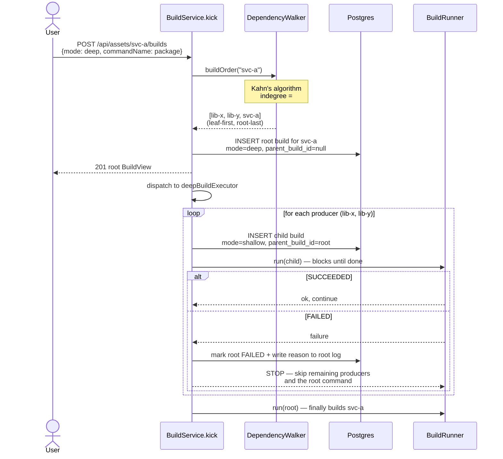
```mermaid
sequenceDiagram
    actor User
    participant API as BuildService.kick
    participant W as DependencyWalker
    participant DB as Postgres
    participant R as BuildRunner

    User->>API: POST /api/assets/svc-a/builds<br/>{mode: deep, commandName: package}
    API->>W: buildOrder("svc-a")
    Note over W: Kahn's algorithm<br/>indegree = #producers
    W-->>API: [lib-x, lib-y, svc-a]<br/>(leaf-first, root-last)
    API->>DB: INSERT root build for svc-a<br/>mode=deep, parent_build_id=null
    API-->>User: 201 root BuildView
    API->>API: dispatch to deepBuildExecutor

    loop for each producer (lib-x, lib-y)
        API->>DB: INSERT child build<br/>mode=shallow, parent_build_id=root
        API->>R: run(child) — blocks until done
        alt SUCCEEDED
            R-->>API: ok, continue
        else FAILED
            R-->>API: failure
            API->>DB: mark root FAILED + write reason to root log
            API-->>R: STOP — skip remaining producers<br/>and the root command
        end
    end

    API->>R: run(root) — finally builds svc-a
```

In contrast, **shallow** mode just inserts one build row (parent=null, mode=shallow) and runs it. There is no walker call, no chain to abort, and no children. See `backend/src/main/java/io/devportal/build/BuildService.java`.

When the asset has no `devportal.yaml.spec.build.commands.<name>`, the runner falls back to a per-tool default keyed off detected build files. Unknown command names still fail loudly so users don't accidentally trigger something unexpected.

### Workspaces

Persistent, never wiped. One per asset at `~/.devportal/workspace/<assetId>/`. Cloned by JGit using the stored PAT. Per-asset locks prevent two builds from racing the working tree. `WorkspaceService.syncCheckout(id, repoUrl, ref)` clones if absent or fetches and checks out otherwise.

### Docker

The `DockerService` reuses the `BuildRunner` infrastructure: `docker build` runs as a regular `Build` row with stdout captured to the same log directory the rest of the build subsystem uses. `docker run` allocates ports from the registry's `local` scope and labels the container with `io.devportal.asset=<id>` so endpoint discovery can correlate it.

When an asset has no `Dockerfile`, `DockerfileScaffolder` writes a thin one (single-stage by design — multi-stage breaks for assets that depend on other portal-managed Maven artifacts because a clean build container can't reach the host's `~/.m2`). It picks Java version from `<maven.compiler.target>` / `JavaLanguageVersion.of(...)` falling back to 21, and supports Maven Spring Boot, Gradle Spring Boot, Node, and shell repos.

### Kubernetes


```mermaid
flowchart LR
    apply["POST /api/assets/{id}/k8s/apply"] --> ns["effectiveNamespace<br/>1. asset.k8s_namespace<br/>2. manifest.spec.kubernetes.namespace<br/>3. devportal.k8s.namespace<br/>4. default"]
    ns --> ensure["ensureNamespace<br/>kubectl create ns if missing"]
    ensure --> path["resolveK8sPath<br/>workspace + manifest.spec.kubernetes.manifestPath<br/>or k8s/"]
    path --> render["renderForApply<br/>patch Service spec.ports nodePort<br/>from k8s-nodeport reservations"]
    render --> rendered["~/.devportal/runtime/{id}/k8s-rendered/"]
    rendered --> kc["kubectl apply -n {ns} -f rendered"]
    kc --> parse["parse apply output<br/>list created/configured resources"]
    parse --> ret["result map"]
```

Per-asset namespace defaults to the repo name (V5 migration backfilled `k8s_namespace = id` for existing rows). The portal calls `ensureNamespace` before every apply, so a clean cluster Just Works.

NodePort patching: the renderer reads multi-doc YAML, finds Services, and for each port whose `name` matches an allocated slot it writes the `nodePort` field. If only one allocation exists, it patches the first port unnamed-fallback.

The cluster module also exposes `pods`, `services`, `pod logs`, `describe`, and `events` per asset, plus a WebSocket pod-exec handler at `/ws/assets/{id}/pods/{pod}/exec`.

### Port registry

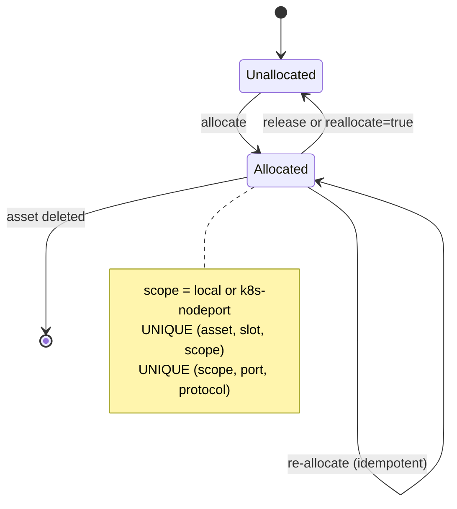
```mermaid
stateDiagram-v2
    [*] --> Unallocated
    Unallocated --> Allocated: allocate
    Allocated --> Allocated: re-allocate (idempotent)
    Allocated --> Unallocated: release or reallocate=true
    Allocated --> [*]: asset deleted

    note right of Allocated
        scope = local or k8s-nodeport
        UNIQUE (asset, slot, scope)
        UNIQUE (scope, port, protocol)
    end note
```

Allocate via `POST /api/assets/{id}/ports?scope=local|k8s-nodeport` — slots are read from the manifest (or inferred), then a free port is picked from the configured pool and persisted in `port_reservation`. Release via `DELETE /api/assets/{id}/ports?scope=...`, or pass `reallocate=true` on POST to wipe and reissue.

Slots come from `spec.runtime.ports` in `devportal.yaml`; if absent, `PortSlotInferrer` infers from real signals (Spring `server.port`, Dockerfile `EXPOSE`, k8s `containerPort`). Pools default to `18000-18999` (local) and `30000-32767` (k8s-nodeport). Two unique constraints make collisions impossible at the DB level.

### Endpoint discovery

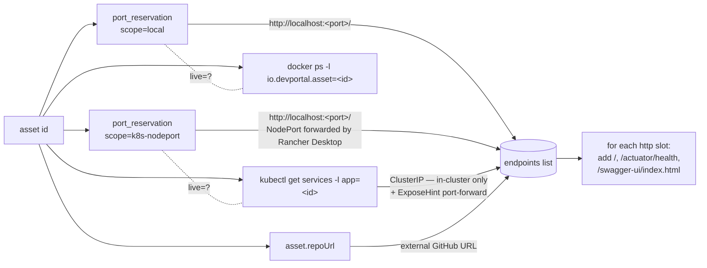
```mermaid
flowchart LR
    A[asset id] --> P1[port_reservation<br/>scope=local]
    A --> P2[port_reservation<br/>scope=k8s-nodeport]
    A --> K[kubectl get services -l app=&lt;id&gt;]
    A --> D[docker ps -l io.devportal.asset=&lt;id&gt;]
    A --> R[asset.repoUrl]

    P1 -->|http://localhost:&lt;port&gt;/| OUT[(endpoints list)]
    P2 -->|http://localhost:&lt;port&gt;/<br/>NodePort forwarded by Rancher Desktop| OUT
    K -->|ClusterIP — in-cluster only<br/>+ ExposeHint port-forward| OUT
    R -->|external GitHub URL| OUT

    P1 -.live=?.- D
    P2 -.live=?.- K

    OUT --> SP[for each http slot:<br/>add /, /actuator/health,<br/>/swagger-ui/index.html]
```

Each endpoint carries a `hostAccessible` flag. ClusterIP entries are flagged `hostAccessible=false` and include an `ExposeHint` that the UI uses to one-click open a port-forward session. See `backend/src/main/java/io/devportal/runtime/endpoints/EndpointsService.java`.

### Port-forward service

`PortForwardService` manages `kubectl port-forward` subprocesses keyed by an in-memory id. On portal restart, all sessions die — port-forwards are dev-time only. Host port is auto-allocated from the configured local pool (skipping anything reserved in `port_reservation` or used by another active session). Stdout is pumped to the log so early failures surface; on process exit the session is marked `stopped` (rc=0) or `failed` (rc!=0).

### Workspace shell

`WorkspaceShellHandler` (WebSocket at `/ws/assets/{id}/workspace/exec?shell=/bin/zsh`) bridges an xterm.js terminal in the browser to a host shell rooted at `~/.devportal/workspace/<assetId>`. The shell is wrapped in `script(1)` to give it a real PTY (otherwise the shell ignores keystrokes since `isatty(stdin)=false`); argument syntax differs between BSD `script` (macOS) and util-linux `script` (Linux), detected at runtime. Whatever branch the workspace is currently checked out to is what the user lands in — handy after a `commit-render` flow.

### Dependency graph UI

`frontend/src/components/DependencyGraph.tsx` lays out the graph with **dagre** (`LR` for "producers right" and `TB` for "producers down"), renders with `@xyflow/react`, and offers a fullscreen viewer overlay. The toolbar shows node/edge counts and the layout toggle.

### Search

Asset search is a single SQL `ILIKE` across id, name, description, owner, language, repo URL, and an `EXISTS` over the `tags` array. Doc search walks every asset's workspace, skipping VCS / build / dep dirs, and substring-matches `.md` files up to ~1 MB each. Results include line number and a 60-char snippet. See `backend/src/main/java/io/devportal/search/SearchService.java`.

### State sync

`StateService` exports each asset to `<state-repo>/assets/<id>.yaml` with its dependency edges, plus `index.yaml` and a generated `README.md`. Import is destructive: the existing assets are deleted before re-inserting from the YAML tree, in two passes (assets first, edges second). Postgres is the source of truth — the YAML repo is a backup, not the system of record.

### Bulk import

`BulkImportService` lists an org's repos via the GitHub API, applies include/exclude regex patterns and language filters, registers each repo as an asset, optionally clones + analyzes + auto-wires. Job state is in-memory keyed by id; the frontend polls `GET /api/bulk-imports/{id}` for live updates. Filter semantics: `(language match) OR (include match)` minus exclude, archived (default skip), forks (default skip). If no language and no include patterns are set, everything passes through.

### Lifecycle hooks (test fixtures + setup hooks)

A general mechanism for declaring named, structured commands an asset exposes — for test-data generation, post-deploy seeding, credential dumps, smoke probes. Declared in `spec.test.fixtures` in `devportal.yaml`. Surfaced in the **Fixtures** tab. Setup-style fixtures with `runOnApply: true` auto-fire after a successful `kubectl apply` when the apply call passes `runHooks=true`.

Output contract: the command emits one line of the form `DEVPORTAL_FIXTURE: {json}`. The JSON carries `summary`, `credentials[]`, and `links[]`. The portal renders a credentials table with click-to-copy passwords and clickable link buttons.

```yaml
spec:
  test:
    fixtures:
      - name: seed-tenants
        description: Provision demo tenants with admin users
        command: bash scripts/devportal-fixture-emit.sh http://localhost:30080
        runOnApply: true            # auto-fire after kubectl apply
        waitForPodsSeconds: 60      # wait for pods Ready before running
```

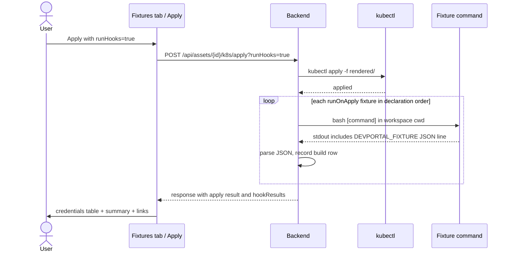
```mermaid
sequenceDiagram
    actor User
    participant UI as Fixtures tab / Apply
    participant API as Backend
    participant K as kubectl
    participant Cmd as Fixture command
    User->>UI: Apply with runHooks=true
    UI->>API: POST /api/assets/{id}/k8s/apply?runHooks=true
    API->>K: kubectl apply -f rendered/
    K-->>API: applied
    loop each runOnApply fixture in declaration order
        API->>Cmd: bash [command] in workspace cwd
        Cmd-->>API: stdout includes DEVPORTAL_FIXTURE JSON line
        API->>API: parse JSON, record build row
    end
    API-->>UI: response with apply result and hookResults
    UI->>User: credentials table + summary + links
```

Full pattern + worked ESP example (seeding 3 tenants + verifying live login) in **[docs/lifecycle-hooks.md](docs/lifecycle-hooks.md)**.

---

## MCP server

The MCP server (`mcp-server/`) is a Node + TypeScript stdio server that wraps the backend REST API. Each registered tool dispatches to a portal helper that issues an HTTP request to `DEVPORTAL_URL` (default `http://localhost:8081`).

| Tool                  | Purpose                                                                  |
|-----------------------|--------------------------------------------------------------------------|
| `list_assets`         | Filter by `q`, `type`, `lifecycle`.                                      |
| `get_asset`           | One asset by id.                                                         |
| `register_from_github`| Register a repo, seeding from `devportal.yaml` if present at HEAD.       |
| `add_dependency`      | Create a `consumer -> producer` edge of `kind=build|runtime`.            |
| `get_graph`           | Producer closure + immediate consumers reachable from an asset.          |
| `kick_build`          | Shallow or deep build, optional `commandName` / `commandLine` / `ref`.   |
| `list_builds`         | Recent builds for an asset.                                              |
| `get_build_log`       | Captured stdout/stderr of one build.                                     |
| `allocate_ports`      | Reserve concrete ports from the registry (`local` or `k8s-nodeport`).    |
| `list_meta_assets`    | Shared infra catalog (postgres-shared, redis-shared, ...).               |
| `attach_consumes`     | Mark an asset as consuming a meta-asset with a role label.               |
| `audit_asset`         | Drift report against portal conventions.                                 |
| `state_git_sync`      | Export portal state to YAML and commit to the state git repo.            |

The server has no port and no state — every tool call is an HTTP request. Restart Claude Code after rebuilding the server (`pnpm build`) to pick up new tools.

---

## Claude Code skills

Skills under `skills/` give Claude a checklist when the user asks for a specific workflow. They prefer MCP tools but read the workspace directly when faster.

| Skill                  | Trigger phrases                                          | What it does                                                                                                                          |
|------------------------|----------------------------------------------------------|---------------------------------------------------------------------------------------------------------------------------------------|
| `devportal-onboard`    | "onboard X", "register X to devportal", "add X"          | Detect language / build / docker / k8s, draft a `devportal.yaml` against the JSON Schema, scaffold doc skeleton, register the asset.   |
| `devportal-audit`      | "audit X", "what's wrong with X", "drift on X"           | Group findings by severity then area, propose concrete fixes, never auto-fix without confirmation.                                     |
| `devportal-docs`       | "doc this", "scaffold docs in X", "normalize docs"       | Render `schema/doc-skeleton/*.tmpl` into the asset repo with placeholder substitution; preserve files that already have real content. |
| `devportal-k8s-convert`| "convert X to k8s", "standardize k8s for X"              | Render or scaffold k8s manifests on a `devportal/...` branch, verify boot via `/verify?stage=docker`, never push to main, one asset per invocation. |

---

## Data model

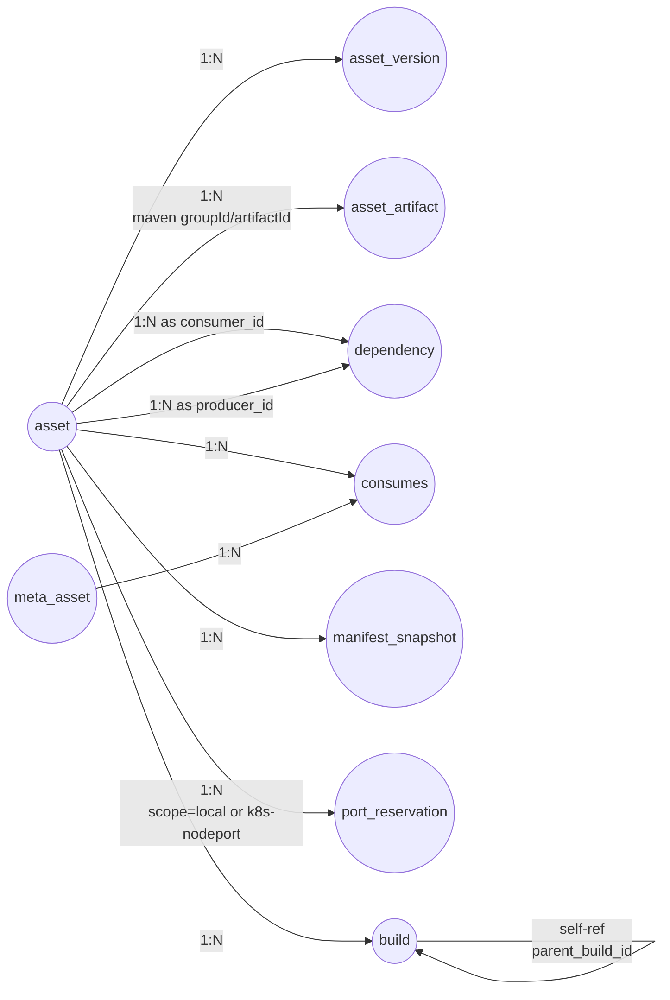
```mermaid
graph LR
    asset((asset))
    asset_version((asset_version))
    asset_artifact((asset_artifact))
    dependency((dependency))
    consumes((consumes))
    meta_asset((meta_asset))
    manifest_snapshot((manifest_snapshot))
    port_reservation((port_reservation))
    build((build))

    asset -->|1:N| asset_version
    asset -->|1:N<br/>maven groupId/artifactId| asset_artifact
    asset -->|1:N as consumer_id| dependency
    asset -->|1:N as producer_id| dependency
    asset -->|1:N| consumes
    meta_asset -->|1:N| consumes
    asset -->|1:N| manifest_snapshot
    asset -->|1:N<br/>scope=local or k8s-nodeport| port_reservation
    asset -->|1:N| build
    build -->|self-ref<br/>parent_build_id| build
```

Migrations live in `backend/src/main/resources/db/migration/`:

- `V1__init.sql` — Flyway baseline.
- `V2__core_schema.sql` — `asset`, `asset_version`, `dependency`, `consumes`, `meta_asset`, `manifest_snapshot`, `port_reservation`.
- `V3__build.sql` — `build` with `mode`, `parent_build_id`, `status`, log path.
- `V4__asset_artifact.sql` — published artifact coordinates per asset.
- `V5__asset_namespace.sql` — `asset.k8s_namespace` (defaults to asset id).

---

## URLs

| URL                                              | What it is                            |
|--------------------------------------------------|---------------------------------------|
| http://localhost:5173                            | DevHub Pro UI                         |
| http://localhost:8081/api/health                 | Backend liveness                      |
| http://localhost:8081/swagger-ui/index.html      | Interactive OpenAPI explorer          |
| http://localhost:8081/v3/api-docs                | Raw OpenAPI JSON                      |
| http://localhost:8081/actuator/health            | Spring actuator                       |

---

## Development

```sh
# Backend tests + build
cd backend && ./gradlew build

# Frontend type-check + bundle
cd frontend && pnpm build

# MCP server
cd mcp-server && pnpm build

# Bring up Postgres
docker compose up -d
```

Spring DevTools is enabled in `developmentOnly` scope: `./gradlew compileJava` from another shell hot-reloads the running app for any code change that doesn't add a Flyway migration. Schema changes still need a full restart.

Logging: `io.devportal` defaults to `DEBUG`. Build logs land in `~/.devportal/logs/<asset>-<ts>.log`. If you background `bootRun`, stdout is at `/tmp/devportal-bootrun.log`.

---

## License

Personal project; no license file yet.
