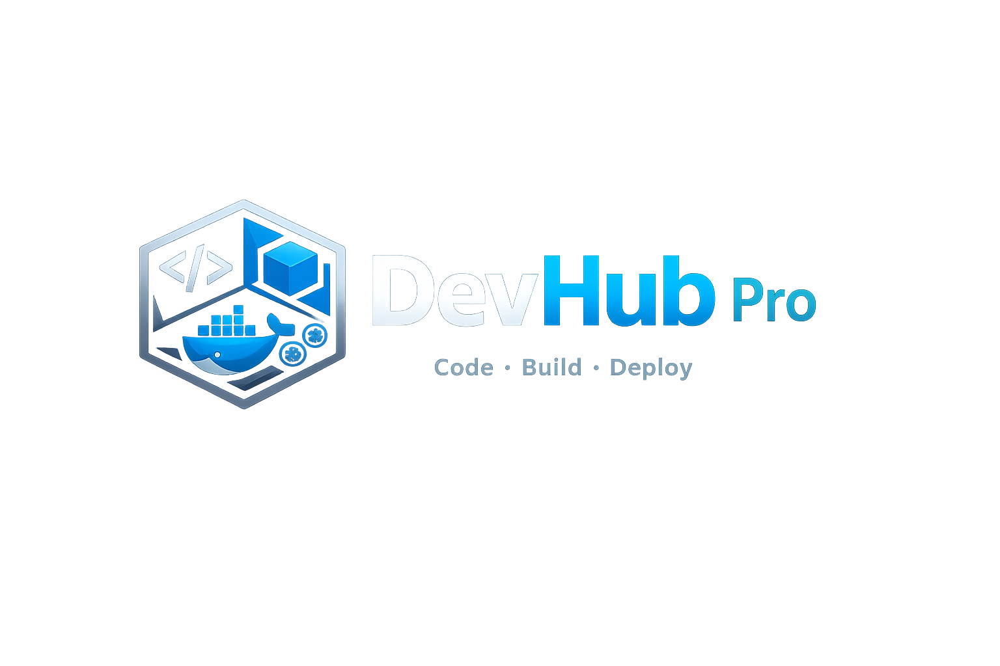

# DevHub Pro

<p align="center">
  
</p>

A single-user developer portal that catalogs GitHub-hosted projects, reconstructs their dependency graph from real build artifacts (poms today; Gradle / npm / go.mod next), drives builds and runtime, and lets Claude Code drive the whole thing through MCP.

> **Code · Build · Deploy** — one place to keep track of everything you own, and one place to do something about it.

## Features

### Catalog & graph
- Register GitHub repos as **assets** one-at-a-time or **bulk-import a whole org** filtered by language and name pattern
- Asset detail with overview, description, GitHub topics, stars / forks / open issues / license, recent **git tags**, last push time
- **Dependency graph** auto-derived from each repo's `pom.xml` (multi-module, with `${prop}` substitution)
- **Auto-wire** matched Maven coordinates to existing portal assets — the producer-closure rebuilds itself
- Graph viewer with **direction control** (producers / consumers / both) and **depth control** (1, 2, 3, 5, all)

### Build orchestration
- **Shallow build** — just this asset
- **Deep build** — topo-sorts the producer closure, runs them in order, links rows by `parent_build_id`
- **Live log streaming** — captured stdout/stderr per build, auto-tails while running, freezes when terminal
- **Chain view** — when one click triggers a deep build of N assets, the UI surfaces all N segments inline so it's obvious what got built
- Sensible per-tool fallbacks when no `devportal.yaml` is present:
  - `pom.xml` → `mvn -DskipTests <goal>`
  - `build.gradle*` → `./gradlew -x test <task>`
  - `package.json` → `<pm> run <script>`

### Runtime — light Kubernetes & docker
- **Port registry**: assets declare named slots (`http`, `metrics`, …); portal allocates concrete ports per scope (`local` / `k8s-nodeport`) from configured pools, with collision-free guarantees
- **Docker**: build image, run container with allocated ports + label, list/stop containers
- **Kubernetes**: `kubectl apply` / `delete` from the workspace's manifest path, pod & service status, link-out hints (`k9s`, `kubectl logs`, optional Grafana)
- **Meta-assets** for shared infrastructure (postgres, redis, opensearch, minio…) — assets `consume` them with a role label

### Discovery & analyze
- **Workspace scanner** identifies `Dockerfile`, `docker-compose.yml`, k8s/ deploy/ manifests/, helm charts, kustomizations
- **Maven analyzer** parses each repo's pom — published artifacts and declared dependencies — and persists asset coordinates so cross-repo matching works
- **GitHub validator** confirms the repo URL parses, is reachable, and reports what build files are present
- **Audit** — drift report against portal conventions: missing manifest, schema errors, missing docs, missing Dockerfile when `docker.enabled`, no port slots, etc.

### Search & docs
- **Global search bar** in the top header — debounced, dropdown results
  - **Asset matches** — ILIKE across id, name, description, owner, language, repo URL, tags
  - **Doc matches** — substring scan of every asset workspace's `.md` files, with line number and snippet
- **Docs tab** per asset — sidebar lists every `.md`, click to render with markdown, toggle Rendered/Raw

### Settings & secrets
- **GitHub PAT** stored at `~/.devportal/secrets/github-token` (mode 0600), settable via UI
- Lookup order: file → `GITHUB_TOKEN` env → none. Hot-swappable: changing it invalidates the GitHub client cache, no restart needed
- **State sync**: dump/load full portal state as YAML to a separate `~/.devportal/state` git repo

### Claude integration (MCP)
- **MCP stdio server** under `mcp-server/` exposes 13 tools:
  - `list_assets`, `get_asset`, `register_from_github`
  - `add_dependency`, `get_graph`
  - `kick_build`, `list_builds`, `get_build_log`
  - `allocate_ports`, `list_meta_assets`, `attach_consumes`
  - `audit_asset`, `state_git_sync`
- **Claude Code skills** under `skills/`:
  - `devportal-onboard` — detect language/build/docker/k8s, draft a `devportal.yaml`, scaffold doc skeleton, register
  - `devportal-audit` — surface drift with concrete fix proposals
  - `devportal-docs` — render the doc-skeleton templates into a managed asset

### UI extensibility
- Build-time React component split per concern (assets, builds, runtime, analyze, docs, panels)
- **Server-driven panels** — `GET /api/assets/{id}/panels` returns a list of `kv | list | code | links` panels rendered generically by the frontend; new panels can be added server-side without touching the UI

---

## Architecture

```
┌────────────────────────────┐    ┌─────────────────────────┐
│  React frontend (Vite, TS) │    │  Claude Code (MCP host) │
│  http://localhost:5173     │    │                         │
└──────────────┬─────────────┘    └──────────┬──────────────┘
               │                              │ stdio
               │ /api/* (proxied)             │
               ▼                              ▼
       ┌────────────────────────────────────────────┐
       │    devportal-mcp-server (Node + TS)        │
       │    13 MCP tools → portal REST              │
       └────────────────────┬───────────────────────┘
                            │ HTTP
                            ▼
       ┌────────────────────────────────────────────┐
       │  Backend — Spring Boot 3 / Java 21         │
       │  Port 8081                                 │
       │                                            │
       │  ┌─────────┐  ┌─────────┐  ┌────────────┐ │
       │  │ assets  │  │ builds  │  │ port reg.  │ │
       │  │ deps    │  │ runner  │  │ meta-asset │ │
       │  │ graph   │  │ chain   │  │ consumes   │ │
       │  └─────────┘  └─────────┘  └────────────┘ │
       │  ┌─────────┐  ┌─────────┐  ┌────────────┐ │
       │  │ analyze │  │ audit   │  │ docs       │ │
       │  │ Maven   │  │ panels  │  │ search     │ │
       │  └─────────┘  └─────────┘  └────────────┘ │
       │  ┌─────────────────────────────────────┐  │
       │  │ github | jgit | kubectl | docker    │  │
       │  └─────────────────────────────────────┘  │
       └────┬─────────────────────┬─────────┬─────┘
            │ JDBC                │ git     │ exec
            ▼                     ▼         ▼
     ┌────────────┐    ┌──────────────────────────┐
     │ Postgres   │    │ ~/.devportal/            │
     │ (Flyway)   │    │   workspace/<asset>/     │
     │            │    │   logs/<build>.log       │
     │            │    │   secrets/github-token   │
     │            │    │   state/                 │
     └────────────┘    └──────────────────────────┘
```

### Source of truth

Postgres is the database of record. The full state can be exported as YAML (`POST /api/state/export`) into a separate git repo for backup, portability, or offline review. State YAML is *not* the source of truth — it's a snapshot.

### Schema (Flyway-managed)

`asset` · `asset_version` · `asset_artifact` · `dependency` · `consumes` · `meta_asset` · `manifest_snapshot` · `port_reservation` · `build`

### Process model

- **Backend** runs in one JVM (Spring Boot 3, embedded Tomcat). Async work — bulk imports, deep build chains, individual build runners — uses a small `ThreadPoolTaskExecutor`.
- **Frontend** runs as a Vite dev server in `pnpm dev` and proxies `/api/*` to the backend so there's no CORS to manage.
- **MCP server** runs as a stdio child process started by Claude Code; it has no port and no state — every tool call hits the backend's REST API.

### Workspaces

Persistent, never wiped. One per asset at `~/.devportal/workspace/<assetId>/`. Cloned by JGit using your stored PAT. Per-asset locks prevent two builds from racing the working tree.

---

## Quickstart

### Prerequisites

- **Java 21** (toolchain — Spring Boot won't compile against older JVMs)
- **Node 20+** with **pnpm** (`brew install node && npm install -g pnpm`)
- **Postgres 15+** running locally (or via Docker — see below)
- **Docker** + **kubectl** (only needed for M3 runtime features)
- A **GitHub Personal Access Token** (classic, scope `repo`) — set later via the UI

### Postgres — pick one

Option A — Docker (uses the bundled compose file):
```sh
docker compose up -d
```

Option B — native Homebrew:
```sh
brew install postgresql@16
brew services start postgresql@16
createuser -s devportal
createdb -O devportal devportal
psql -d devportal -c "ALTER ROLE devportal WITH PASSWORD 'devportal';"
```

### Backend — http://localhost:8081

```sh
cd backend
./gradlew bootRun
```

Flyway runs all migrations on first start. The backend is now listening; logs land in `/tmp/devportal-bootrun.log` if you backgrounded it.

### Frontend — http://localhost:5173

```sh
cd frontend
pnpm install
pnpm dev
```

Vite proxies `/api/*` to the backend.

### MCP server (optional — for Claude Code integration)

```sh
cd mcp-server
pnpm install
pnpm build
```

Then in `~/.claude/mcp.json`:

```json
{
  "mcpServers": {
    "devportal": {
      "command": "node",
      "args": ["/absolute/path/to/dev_portal/mcp-server/dist/index.js"],
      "env": { "DEVPORTAL_URL": "http://localhost:8081" }
    }
  }
}
```

Restart Claude Code → 13 `mcp__devportal__*` tools become available.

### Skills (optional)

```sh
mkdir -p ~/.claude/skills
ln -s "$(pwd)/skills/devportal-onboard" ~/.claude/skills/
ln -s "$(pwd)/skills/devportal-audit"   ~/.claude/skills/
ln -s "$(pwd)/skills/devportal-docs"    ~/.claude/skills/
```

---

## First-run walkthrough

1. Open **http://localhost:5173** → click **Settings**, paste your GitHub PAT, click **Test connection**.
2. Click **Bulk import**, owner `geekychris` (or your own org), tick **Java** + **Kotlin**, optional include pattern `^hitorro-`. Click **Run import**.
3. After ~1 minute, **/assets** lists your registered repos.
4. Open `/assets/<some-java-repo>` → **analyze** tab → **Analyze pom.xml** → **Auto-wire matched deps**. Repeat for a few repos to populate the graph.
5. Click **graph** tab → switch direction / depth → see the dep tree.
6. **builds** tab → pick mode `deep`, command `package` → **Run build** → watch the chain assemble.
7. Top-bar **search** → type `spring` → see assets and doc snippets that match.

---

## Layout

| Path                | Purpose                                                         |
|---------------------|-----------------------------------------------------------------|
| `backend/`          | Spring Boot 3 + Java 21 + Postgres. Source of truth.            |
| `frontend/`         | Vite + React 18 + TypeScript UI.                                |
| `mcp-server/`       | MCP stdio server exposing portal ops to Claude Code.            |
| `skills/`           | Claude Code skills for onboarding/auditing/documenting assets.  |
| `schema/`           | `devportal.yaml` JSON Schema, doc-skeleton templates.           |
| `docker-compose.yml`| Postgres for local dev.                                         |
| `devhubpro.png`     | Brand logo, served at `/devhubpro.png`.                         |

---

## URLs

| URL                                              | What it is                            |
|--------------------------------------------------|---------------------------------------|
| http://localhost:5173                            | DevHub Pro UI                         |
| http://localhost:8081/api/health                 | Backend liveness                      |
| http://localhost:8081/swagger-ui/index.html      | Interactive OpenAPI explorer          |
| http://localhost:8081/v3/api-docs                | Raw OpenAPI JSON                      |
| http://localhost:8081/actuator/health            | Spring actuator (DB, etc.)            |

---

## Configuration

Backend reads from `application.yml` plus env overrides:

| Key                              | Env var                  | Default                                  |
|----------------------------------|--------------------------|------------------------------------------|
| `devportal.github.token`         | `GITHUB_TOKEN`           | (file at `~/.devportal/secrets/...` wins) |
| `devportal.workspace.dir`        | `DEVPORTAL_WORKSPACE_DIR`| `~/.devportal/workspace`                 |
| `devportal.state.repo`           | `DEVPORTAL_STATE_REPO`   | `~/.devportal/state`                     |
| `devportal.ports.local.{start,end}` | —                     | `18000-18999`                            |
| `devportal.ports.k8s-nodeport.{start,end}` | —              | `30000-32767`                            |
| `devportal.k8s.namespace`        | —                        | `default`                                |
| `devportal.k8s.monitoring-base-url` | —                     | empty (Grafana link disabled)            |

DB credentials and port via standard Spring overrides (`DEVPORTAL_DB_*`, `server.port`).

---

## Development

```sh
# Backend tests + build
cd backend && ./gradlew build

# Frontend type-check + bundle
cd frontend && pnpm build

# MCP server
cd mcp-server && pnpm build
```

The backend has Spring DevTools enabled in `developmentOnly` scope: `./gradlew compileJava` from another shell hot-reloads the running app for any code change that doesn't add a new Flyway migration. Schema changes still need a full restart.

---

## License

Personal project; no license file yet.
